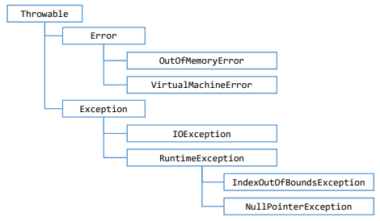
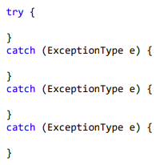
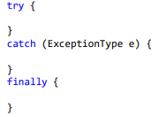

# Exceções

---

Uma exceção é qualquer condição de erro ou comportamento inesperado encontrado por um programa em execução.

Em Java, uma exceção é um objeto herdado da classe:
java.lang.Exception - o compilador obriga a tratar ou propagar.
java.lang.RuntimeException - o compilador não obriga a tratar ou propagar.

Quando lançada, uma exceção é propagada na pilha de chamadas de métodos em execução, até que seja capturada (tratada) ou o programa seja encerrado.

- Error: Não é esperado que o programador trate esses erros.
- Exception: Erros que podem e esperam que sejam tratados.
  IOException: Erro de entrada e saída.
  RuntimeException: Compilador não obriga a tratar
- IndexOutOfBoundsExceptions: quando tenta acessar a posição de um array que não existe.
- NullPointerException: Quando tenta acessar uma variável que dá nulo.

O tratamento de exceções permite que os erros sejam tratados de uma forma consistente e flexível, usando boas práticas.

Vantagens:
- Delega a lógica do erro para a classe responsável por conhecer as regras que podem ocasionar o erro.
- Trata de forma organizada (inclusive hierárquica) exceções de tipos diferentes.
- A exceção pode carregar dados quaisquer.

### try-catch

- Bloco try

  Contém o código que representa a execução normal do trecho de código que pode acarretar em uma exceção.

- Bloco catch

  Contém o código a ser executado caso uma exceção ocorra.

  Deve ser especificado o tipo da exceção a ser tratada. (upcasting é permitido)

- Demo

### finally

É um bloco que contém código a ser executado independentemente de ter ocorrido ou não uma exceção.

Exemplo: Fechar um arquivo, conexão de banco de dados ou outro recurso específico ao final do processamento.

